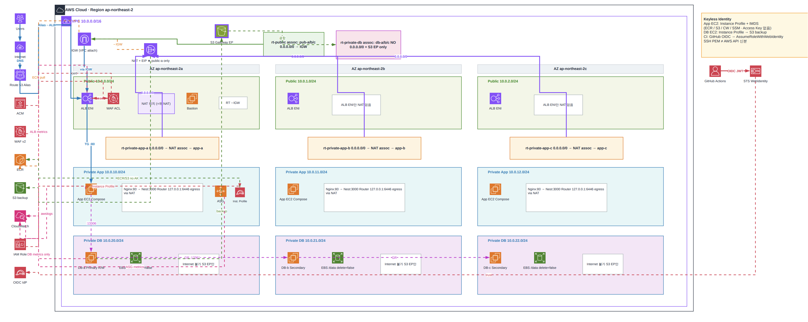

# AWS EKS 기반 컨테이너 배포 및 서버리스 하이브리드 아키텍처

> 관리형 서비스(ECS, RDS)에 의존하지 않고 EC2(단일 호스트)와 EKS(오케스트레이션) 환경을 비교 구축하며, S3·API Gateway·Lambda·RDS Proxy를 결합해 트래픽을 최적화한 실무형 웹 서비스 인프라입니다.

 

## Architecture 

  

 

## 🛠 Tech Stack
- **Cloud/Infra** : AWS (VPC, EKS, EC2, ASG, ALB, S3, Route53, API Gateway, Lambda, RDS Proxy)
- **Container / IaC** : Kubernetes(EKS), Docker Compose, Terraform
- **Application** : Nginx, FastAPI, MySQL (InnoDB Cluster)

 

## Troubleshooting & 구축 백서 (상세 문서)
본 레포지토리는 최종 인프라 설정 파일(`yaml`, `conf`, `sh`)만 요약되어 있습니다. 
인프라 프로비저닝 과정, 서버리스 라우팅 설계 의도, 그리고 **구축 과정에서 겪은 치열한 트러블슈팅 내역(RDS Proxy 연동, VPC 네트워크 격리 등)은 아래 기술 블로그에 모두 상세히 기록**해 두었습니다.

**[기술 블로그 : 트러블슈팅 및 아키텍처 구축 일지 보러가기](https://backbone-archive.tistory.com/category/교육/중간%20실습%20평가)**